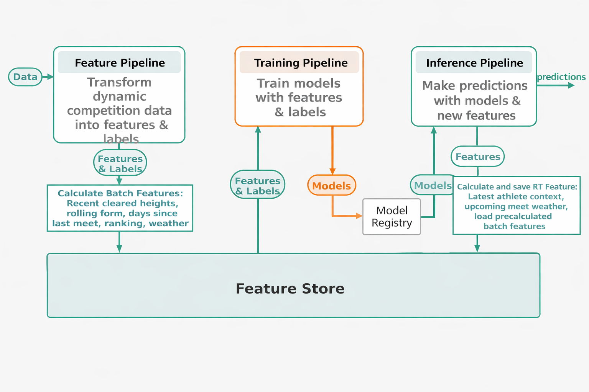

# High Jump Live ML System

This project implements a live machine learning system for predicting men’s outdoor high jump results from regularly updated World Athletics data.

It fetches new competition results, transforms them into athlete-level features, stores processed datasets as versioned Parquet files, trains and compares models with MLflow, and serves the currently deployed model through a Streamlit prediction UI.

The pipeline is reproducible with Docker, automated with GitHub Actions, and deployed on Google Cloud Run, showing the feature, training, and inference workflow from dynamic data ingestion to predictions, with artifacts and model metadata kept traceable.

## FTI architecture diagram

