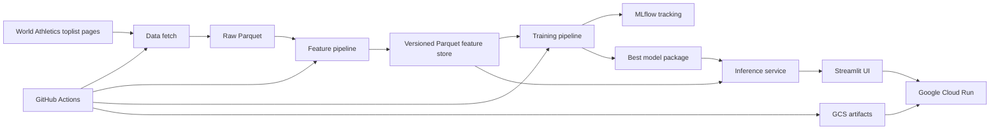

# High Jump Live ML System (MLOPS - Project)

Live machine learning system for predicting men's outdoor high jump performance from dynamic World Athletics result data.

**Live demo:** [Open the Streamlit UI on Cloud Run](https://highjump-ui-95300218507.europe-west6.run.app)

The current model predicts an athlete's **next available competition mark** in meters. The main goal is a working MLOps system: dynamic data ingestion, feature generation, versioned feature storage, model training, experiment tracking, automation, and serving through a UI.

## Project scope

The original proposal targeted next-competition high jump prediction. During implementation, detailed per-attempt data was not reliably available from the selected source, so this baseline predicts the next available competition result from World Athletics toplist data.

The system predicts the expected height result for the athlete's next recorded competition. It does not predict the exact future competition date or full attempt series.

## Data source

The data comes from the public World Athletics toplist pages for men's outdoor senior high jump.

The fetch pipeline collects multiple recent seasons from URLs in this form:

```text
https://worldathletics.org/records/toplists/jumps/high-jump/outdoor/men/senior/{year}
```

Each page is parsed into structured rows with:

- rank
- mark
- competitor
- date
- venue
- position
- date of birth
- results score
- source year and source page

The current year is refreshed on each fetch, while older years can be reused from the local cache when valid. This keeps the dataset dynamic without unnecessarily re-downloading stable historical pages.

## Architecture

The project follows the FTI architecture with separate feature, training, and inference pipelines.



## Pipeline outputs

| Layer | Path | Purpose |
| --- | --- | --- |
| Raw data | `data/raw/highjump_results.parquet` | Parsed World Athletics result rows |
| Latest feature store | `data/features/highjump_features.parquet` | Latest athlete-level training and inference features |
| Versioned feature store | `data/features/versions/<version_id>/highjump_features.parquet` | Timestamped Parquet feature-store snapshot |
| Feature version metadata | `data/features/latest_feature_version.json` | Metadata for the latest feature-store version |
| Model artifact | `models/highjump_model.joblib` | Best trained model package |
| Deployed run id | `models/latest_mlflow_run.txt` | MLflow run id of the selected deployed model |
| MLflow tracking | `mlruns/` | Local experiment tracking data |

The feature store is implemented with Parquet files. Every feature pipeline run writes both a latest feature file and a timestamped versioned feature-store file. The metadata file records the version id, latest path, versioned path, source path, row count, and creation timestamp.

In CI/CD, the latest raw data, latest features, feature-version metadata, versioned feature Parquet file, model package, and deployed MLflow run id are uploaded to Google Cloud Storage under the configured `GCS_ARTIFACT_PREFIX`.

## What the system does

1. Fetches dynamic men's outdoor high jump data from World Athletics toplist pages.
2. Builds athlete-level features: previous mark, rolling 3/5 result means and medians, season best, result rank, performance change, and days since previous competition.
3. Saves the processed features as both latest and versioned Parquet feature-store files.
4. Trains and compares Linear Regression, Random Forest, and HistGradientBoosting regression models.
5. Selects the best model by MAE and logs metrics, parameters, artifacts, and deployment status with MLflow.
6. Serves predictions through a CLI and Streamlit UI.
7. Re-runs the pipeline with GitHub Actions and deploys the UI to Google Cloud Run.

## Reproducibility

Prerequisites:

- Docker
- Make
- uv, only needed for running tests directly with `make test`

Run the full local pipeline:

```bash
make build
make fetch
make features
make train
make inference
```

Run inference for a selected athlete:

```bash
make inference ATHLETE="Gianmarco TAMBERI"
```

Run local UIs:

```bash
make ui      # open http://localhost:8501
make mlflow  # open http://localhost:5001
```

Run unit tests:

```bash
make test
```

## Cloud artifacts

The deployed app can load required inference artifacts from Google Cloud Storage when these environment variables are set:

```text
PROJECT_ID=your-gcp-project-id
GCS_BUCKET_NAME=your-bucket-name
GCS_ARTIFACT_PREFIX=latest
```

Useful commands:

```bash
make upload-cloud-artifacts
make download-cloud-artifacts
```

Do not commit `.env` or service account keys.

## Automation and deployment

The GitHub Actions workflow runs on pushes to `main`, manual dispatch, and a weekly schedule. It installs dependencies, runs tests, builds Docker, fetches fresh data, builds features, trains models, runs an inference smoke test, uploads artifacts to GCS, verifies the uploaded artifacts, and deploys the Streamlit UI to Cloud Run.

## Model monitoring and traceability

MLflow tracks the model comparison runs, metrics, parameters, selected model, and deployment status. The deployed model package stores the model name, model type, feature columns, target column, prediction type, and evaluation metrics. The file `models/latest_mlflow_run.txt` records which MLflow run produced the currently deployed model.

## Repository structure

Main code lives in `src/highjump_mlops/`:

- `data`: scraping and parsing World Athletics result pages
- `features`: feature engineering and versioned Parquet feature-store writing
- `training`: model training, model comparison, and MLflow logging
- `inference`: prediction service and CLI
- `ui`: Streamlit app
- `cloud`: GCS artifact upload/download helpers

Tests are in `tests/`, CI/CD is in `.github/workflows/`, and the final short markdown deliverable is `PROJECT_SUMMARY.md`.

## Tech stack

Python 3.13, Docker, uv, pandas, pyarrow, scikit-learn, MLflow, Streamlit, Google Cloud Storage, Google Cloud Run, GitHub Actions, pytest.

## Known limitations

- The model predicts the next available competition mark, not the exact future competition date.
- Attempt-level high jump series data is not included because it was not reliably available from the selected source.
- The deployed Cloud Run app depends on the latest uploaded GCS artifacts being available.
